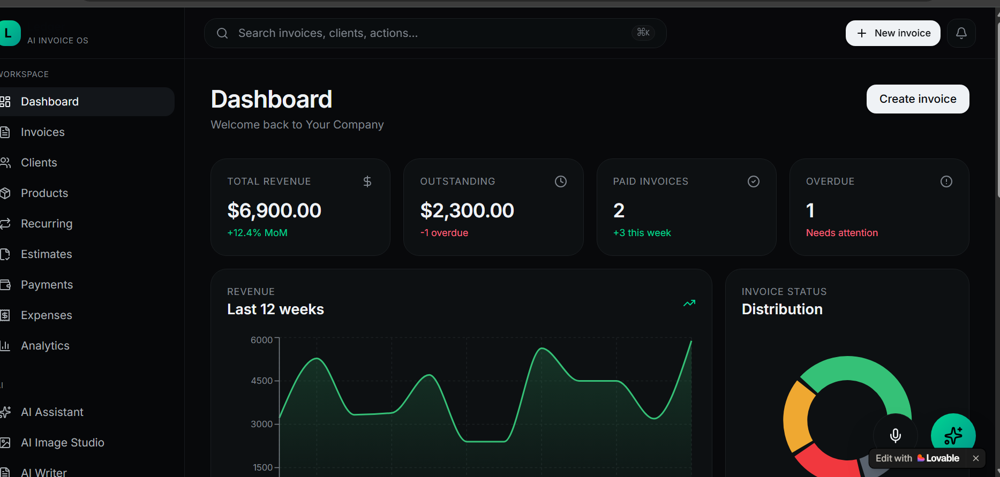
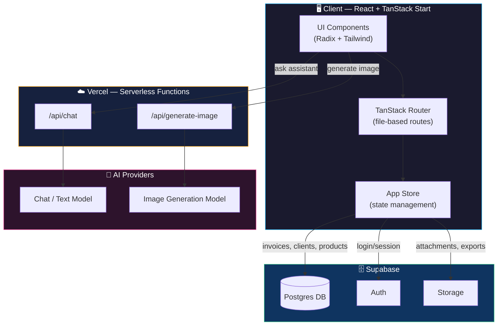
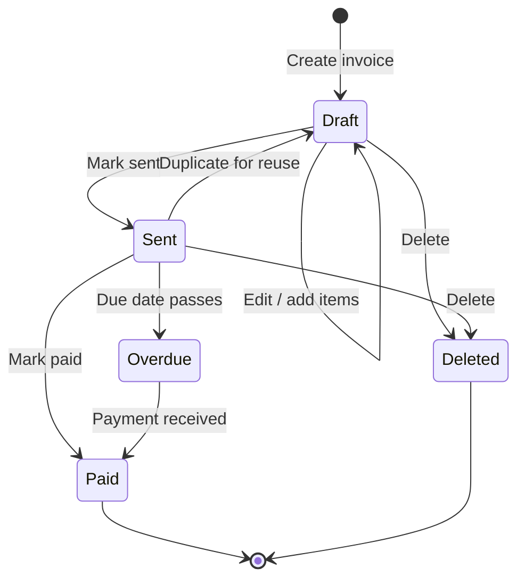
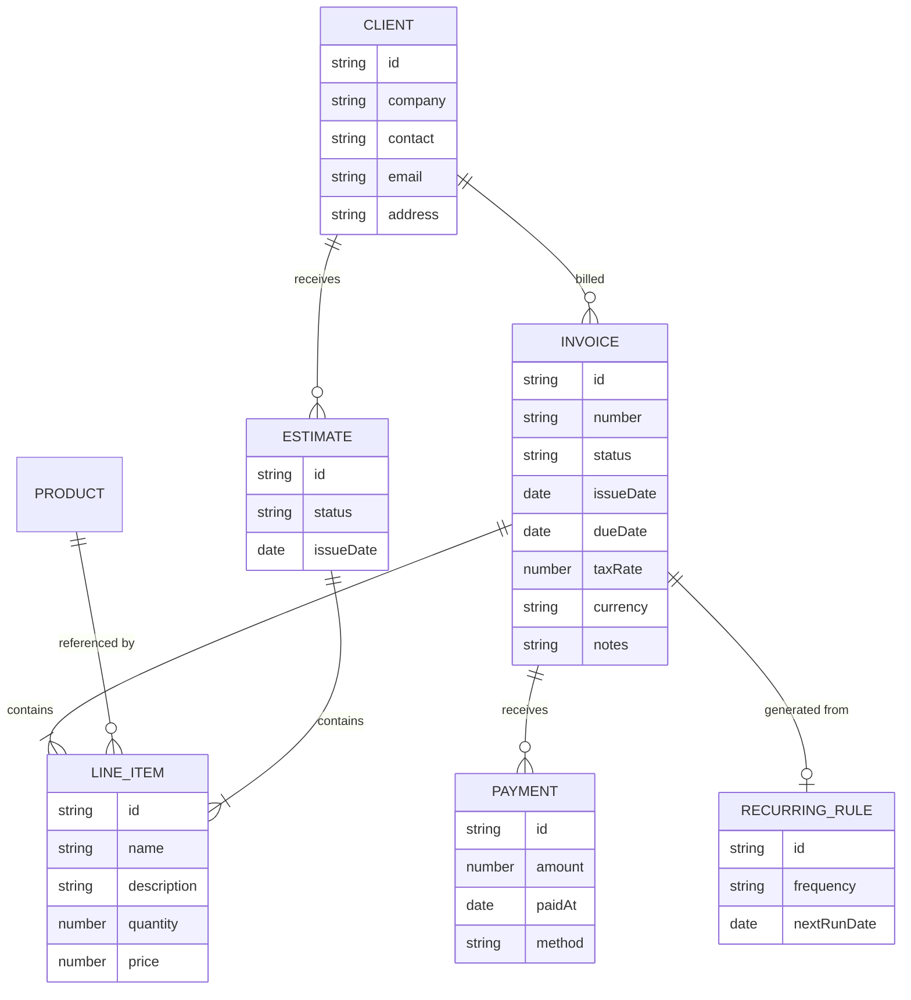
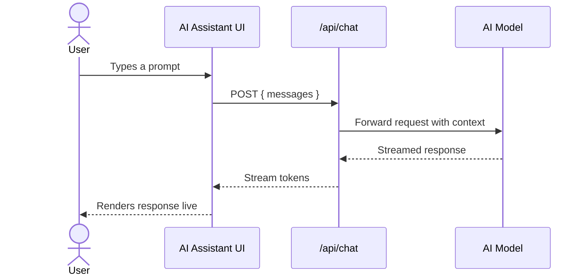

<div align="center">



# 🧾 InvoiceFlow AI

**AI-powered invoicing, built for freelancers and small teams who'd rather ship than do paperwork.**

Create invoices, chat with an AI assistant, generate images, and get paid — all from one clean dashboard.

[](https://tanstack.com/start)
[](https://supabase.com)
[](https://www.typescriptlang.org/)
[](https://vercel.com)
[](./LICENSE)

[Live Demo](#) · [Report Bug](../../issues) · [Request Feature](../../issues)

</div>

---

## ✨ Why InvoiceFlow AI

Most invoicing tools are either bloated SaaS platforms or bare-bones templates. InvoiceFlow AI sits in the middle — a fast, modern dashboard with an **AI copilot baked in**, so drafting line items, rewriting client notes, or generating quick visuals doesn't mean leaving the app.

- 📄 **Full invoice lifecycle** — draft, send, track, mark paid, duplicate, export as PDF
- 🤖 **AI Assistant** — a chat-based business copilot for drafting and analysis
- 🎨 **AI Image Studio** — generate visuals directly inside the workspace
- 👥 **Client & product management** — reusable clients, catalog items, recurring invoices
- 📊 **Analytics** — see revenue, outstanding balances, and trends at a glance
- 💳 **Payments & expenses** — track money in and out in one place
- 🎙️ **Voice** — voice-driven input for faster data entry

---

## 🖥️ Feature Overview

| Module | What it does |
|---|---|
| **Dashboard** | Snapshot of revenue, outstanding invoices, and recent activity |
| **Invoices** | Create, edit, duplicate, print, and export invoices as PDF |
| **Clients** | Store contact + billing details for repeat customers |
| **Products** | Reusable catalog items with pricing |
| **Recurring** | Automate invoices that repeat on a schedule |
| **Estimates** | Send quotes before work begins, convert to invoices later |
| **Payments** | Track incoming payments against invoices |
| **Expenses** | Log business costs alongside revenue |
| **Analytics** | Visual breakdown of business performance |
| **AI Assistant** | Chat-based help for drafting, rewriting, and analysis |
| **AI Image Studio** | Generate images for invoices, branding, or marketing |
| **Voice** | Speak instead of typing for quick actions |

---

## 🏗️ Architecture



---

## 🔄 Invoice Lifecycle



---

## 🧩 Data Model



---

## 💬 AI Assistant Request Flow



---

## 🛠️ Tech Stack

**Frontend**
- [React 19](https://react.dev/) + [TypeScript](https://www.typescriptlang.org/)
- [TanStack Start](https://tanstack.com/start) & [TanStack Router](https://tanstack.com/router) — file-based routing, SSR
- [TanStack Query](https://tanstack.com/query) — data fetching & caching
- [Tailwind CSS 4](https://tailwindcss.com/) + [Radix UI](https://www.radix-ui.com/) primitives
- [Recharts](https://recharts.org/) — analytics visualizations
- [React Hook Form](https://react-hook-form.com/) + [Zod](https://zod.dev/) — forms & validation
- [Framer Motion / Motion](https://motion.dev/) — animation
- [jsPDF](https://github.com/parallax/jsPDF) — client-side PDF export

**Backend**
- [Supabase](https://supabase.com/) — Postgres, Auth, Storage
- Vercel Serverless Functions — AI chat & image generation endpoints

**Tooling**
- [Vite](https://vitejs.dev/) (Rolldown) — build tooling
- [ESLint](https://eslint.org/) + [Prettier](https://prettier.io/) — linting & formatting
- [pnpm](https://pnpm.io/) — package management

---

## 🚀 Getting Started

### Prerequisites
- Node.js 20+
- pnpm
- A [Supabase](https://supabase.com/) project

### Installation

```bash
git clone https://github.com/Anurag13075/invoice-AI-.git
cd invoice-AI-
pnpm install
```

### Environment Variables

Create a `.env` file in the project root:

```dotenv
VITE_SUPABASE_URL="your-supabase-project-url"
VITE_SUPABASE_PROJECT_ID="your-supabase-project-id"
VITE_SUPABASE_PUBLISHABLE_KEY="your-supabase-publishable-key"

# AI provider key(s) — required for AI Assistant & Image Studio
AI_PROVIDER_API_KEY="your-ai-provider-key"
```

### Run locally

```bash
pnpm dev
```

Visit `http://localhost:3000` (or the port shown in your terminal).

### Build for production

```bash
pnpm build
pnpm preview
```

---

## 📁 Project Structure

```
invoice-AI-/
├── src/
│   ├── routes/                  # File-based routes (TanStack Router)
│   │   ├── _app.invoices.$invoiceId.tsx
│   │   ├── _app.studio.tsx
│   │   └── ...
│   ├── components/
│   │   └── app/
│   │       ├── primitives.tsx   # Shared UI primitives
│   │       └── AIChatDock.tsx   # AI Assistant chat dock
│   ├── lib/
│   │   ├── store.ts             # App state & data helpers
│   │   └── format.ts            # Currency/date formatting
│   └── ...
├── public/
├── package.json
└── README.md
```

---

## 🗺️ Roadmap

- [ ] Multi-currency support with live exchange rates
- [ ] Client self-serve payment portal
- [ ] Recurring invoice automation via scheduled jobs
- [ ] Team accounts & role-based permissions
- [ ] Mobile app companion

---

## 🤝 Contributing

Contributions are welcome. Please open an issue first to discuss what you'd like to change.

```bash
git checkout -b feature/your-feature
git commit -m "Add: your feature"
git push origin feature/your-feature
```

Then open a PR 🚀

---

## 📄 License

Distributed under the MIT License. See `LICENSE` for details.

---

<div align="center">

Built solo, in public, by **[Anurag](https://x.com/AnuragShar74342)** 🚀

</div>
